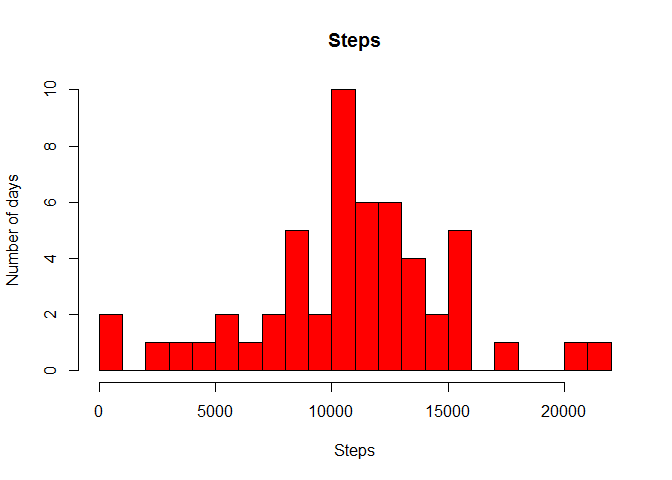
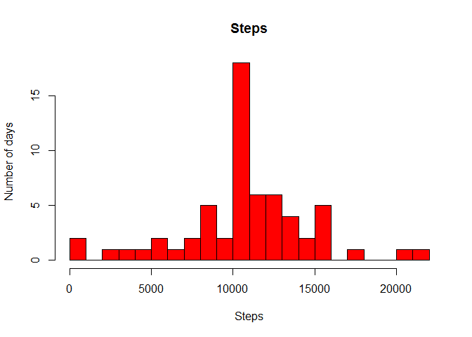
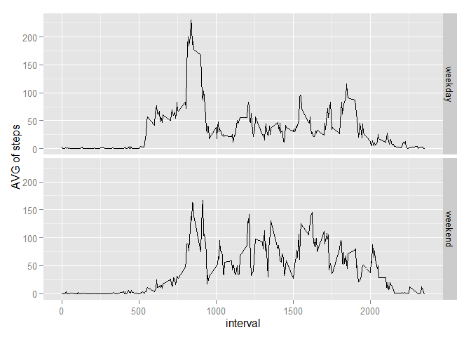

# Reproducible Research: Peer Assessment 1


## Loading and preprocessing the data

```r
unzip(zipfile = "activity.zip", overwrite = TRUE)        

rawdata <- read.csv("activity.csv")
```

## What is mean total number of steps taken per day?

```r
noNA_data <- rawdata[!is.na(rawdata$steps),]

aggregated_data <- aggregate(steps~date, data=noNA_data, sum)

hist(aggregated_data$steps, breaks = 20, xlab="Steps", ylab="Number of days", 
     main="Steps", col ="red")
```

 

```r
mean(aggregated_data$steps)
```

```
## [1] 10766.19
```

```r
median(aggregated_data$steps)
```

```
## [1] 10765
```

## What is the average daily activity pattern?


```r
aggregated_data2 <- aggregate(steps~interval, data=noNA_data, mean)

plot(x=aggregated_data2$interval, y= aggregated_data2$steps, 
     ylab="Average Number of Steps", type="l", xlab="")
```

 

```r
maximum_interval <- aggregated_data2[aggregated_data2$steps==max(aggregated_data2$steps),]

maximum_interval
```

```
##     interval    steps
## 104      835 206.1698
```

## Imputing missing values


```r
number_of_NAs <- sum(is.na(rawdata$steps))

number_of_NAs
```

```
## [1] 2304
```

```r
NA_data <- rawdata[is.na(rawdata$steps),]

NA_data$steps <- aggregated_data2[aggregated_data2$interval==NA_data$interval, 2]

for(i in 1:nrow(NA_data)){
        NA_data[i,1] <- aggregated_data2[aggregated_data2$interval==NA_data[i,3], 2] 
}
new_dataset <- rbind(NA_data, noNA_data)

aggregated_data3 <- aggregate(steps~date, data=new_dataset, sum)

hist(aggregated_data3$steps, breaks = 20, xlab="Steps", ylab="Number of days", main="Steps", col ="red")
```

 

```r
mean(aggregated_data3$steps)
```

```
## [1] 10766.19
```

```r
median(aggregated_data3$steps)
```

```
## [1] 10766.19
```

## Are there differences in activity patterns between weekdays and weekends?

```r
library(ggplot2)
```

```
## Warning: package 'ggplot2' was built under R version 3.1.3
```

```r
f_type_day <- function(vday) {

        if(weekdays(strptime(vday, "%Y-%m-%d")) %in% c("sábado","domingo")) 
                return ("weekend")  
        else return ("weekday")
}

new_dataset$typeday <- sapply(new_dataset$date, FUN = f_type_day)

aggregated_data4 <- aggregate(steps~interval+typeday, data=new_dataset, mean)

ggplot(aggregated_data4, aes(interval, steps)) + geom_line() + facet_grid(typeday ~ .) +
        xlab("interval") + ylab("AVG of steps")
```

 

